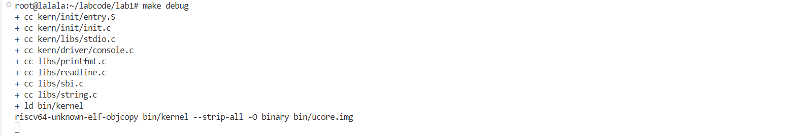
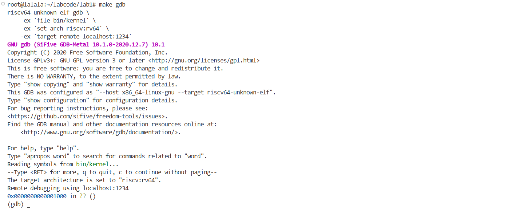
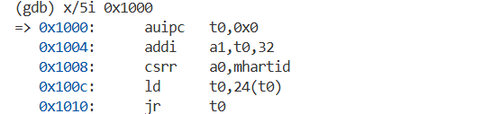
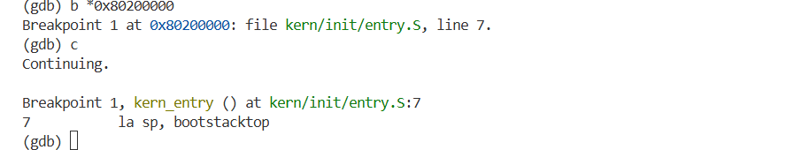

## 实验一 报告

**小组成员:**

| 姓名 | 学号 | 任务分工 |
| :--- | :--- | :--- |
| 陈翔 | 2314035 | 完成练习1解答，总结链接脚本知识点 |
| 查许琴 | 2314076 | 完成练习2解答，负责GDB调试与截图 |
| 刘璇 | 2313255 | 完成思考题，整合最终报告并校对 |

**仓库地址:** [https://github.com/xiaozha233/OS.git](https://github.com/xiaozha233/OS.git)

---

### 一、 实验目的

本次实验的核心目标为，构建一个最基础、最小化的操作系统内核。通过这个过程，深入理解操作系统启动的完整流程，具体包括：

1.  **掌握启动链:** 学习和理解在QEMU模拟的RISC-V平台上，从硬件加电复位开始，控制权如何通过MROM、OpenSBI固件，最终传递到我们编写的内核代码。
2.  **理解内存布局:** 学习如何使用链接脚本（Linker Script）来精确控制内核代码和数据在内存中的布局，确保内核被正确加载到OpenSBI期望的`0x80200000`地址。
3.  **构建底层I/O:** 学习在没有标准库支持的裸机环境下，如何通过RISC-V的`ecall`指令调用OpenSBI固件提供的服务，并在此基础上层层封装，最终实现一个类似`printf`的格式化输出函数`cprintf`。
4.  **熟悉调试工具:** 初步掌握使用GDB和QEMU进行远程调试的方法，为后续更复杂的内核开发打下坚实的基础。

---

### 二、 实验练习解答

#### **练习1：理解内核启动中的程序入口操作**

**1. 指令 `la sp, bootstacktop` 完成了什么操作，目的是什么？**
*   **操作分析:**
    `la sp, bootstacktop` 是一条RISC-V汇编伪指令，意为 "Load Address"。它将符号 `bootstacktop` 的内存地址加载到 `sp` (Stack Pointer) 寄存器中。在我们的代码里，`bootstacktop` 是通过链接脚本和汇编代码定义的一个标签，它指向我们为内核栈预留的内存空间的**顶部（最高地址处）**。

    ```assembly
    // kern/init/entry.S
    .section .data
        .align PGSHIFT 
        .global bootstack 
    bootstack:
        .space KSTACKSIZE // 预留一块名为bootstack的内存，大小为KSTACKSIZE
        .global bootstacktop 
    bootstacktop: // bootstacktop标签紧随其后，即这块内存的末尾
    ```

*   **目的:**
    这条指令的**核心目的是初始化内核的栈指针**。任何C语言函数的执行都依赖于栈的存在，用于存储局部变量、函数参数、返回地址等信息。RISC-V架构的栈是**向下生长**的（即从高地址向低地址扩展）。因此，在调用任何C函数之前，必须将`sp`寄存器指向一块合法、可用内存区域的顶端。`la sp, bootstacktop` 正是完成了这个至关重要的准备工作，为即将跳转到的C函数 `kern_init` 搭建了必要的运行环境。

    **内核栈内存示意图:**
    ```
        低地址  ^
                |
    bootstack ->+-----------------+  <-- 栈 (Stack)
                |                 |
                |   KSTACKSIZE    |
                |     字节        |
                |                 |
    bootstacktop->+-----------------+  <-- 栈顶 (Stack Top), sp初始指向这里
                |
        高地址  v
    ```
**2. 指令 `tail kern_init` 完成了什么操作，目的是什么？**
*   **操作分析:**
    `tail kern_init` 同样是一条伪指令，它会被汇编器翻译成一条**无条件跳转指令**（通常是`jal`或`jr`），直接将CPU的程序计数器（PC）设置为 `kern_init` 函数的起始地址。

*   **目的:**
    这条指令的**核心目的是将CPU的控制权从汇编代码 (`entry.S`) 安全地转移到C代码 (`kern_init`)**。
    
    值得注意的是，这里使用的是`tail`（尾调用），而不是常规的`call`。`call`指令会保存返回地址，期望被调用函数执行完毕后能返回。但`kern_entry`的使命在设置好栈并跳转后便已彻底完成，它**不期望`kern_init`返回**。使用`tail`进行跳转，避免了在栈上保存一个无用的返回地址，这是一种**尾调用优化**。它使得`kern_init`函数直接取代了`kern_entry`，成为函数调用栈的第一个（也是唯一的）栈帧，逻辑上更为清晰，也略微节省了栈空间。


#### **练习2: 使用GDB验证启动流程**

**1. 调试过程、观察结果和问题答案**

*   **调试过程记录:**
    我们分别在两个终端输入make debug和make gdb命令启动调试：
    
    
    GDB成功连接后，显示程序暂停在地址 `0x0000000000001000 in ?? ()`。这表明，QEMU模拟的RISC-V硬件加电后，CPU执行的第一条指令位于物理地址 `0x1000`。
    我们使用 `x/5i 0x1000` 命令来反汇编该地址处的指令，得到的**实际输出**如下：
    

    为了验证完整的启动链，我们在内核的入口地址 `0x80200000` 处设置断点 `b *0x80200000`，然后输入 `c` 继续执行。程序正确地停在了`kern/init/entry.S`的`kern_entry`处，证明了从`0x1000`开始的固件最终成功将控制权交给了我们的内核：
    
*   **问题回答:**
    **RISC-V 硬件加电后最初执行的几条指令位于什么地址？它们主要完成了哪些功能？**
    *   **地址:** 位于物理地址 **`0x1000`**。这是QEMU为该`virt`机器指定的硬件复位向量地址。
    
    *   **主要功能:** 位于此处的代码是固化在**MROM**（Machine ROM）中的一小段底层初始化程序，是整个启动链的起点。根据我实际调试观察到的汇编指令，它们主要完成了以下功能：
        1.  `auipc t0, 0x0`: 获取当前指令的地址，即`0x1000`，存入`t0`寄存器。这是实现地址无关代码的常用技巧。
        2.  `addi a1, t0, 32`: 计算`0x1000 + 32 = 0x1020`，并将结果存入`a1`寄存器。`a1`是第二个函数参数寄存器，这里可能是在为接下来的跳转准备参数。
        3.  `csrr a0, mhartid`: 读取`mhartid`（硬件线程ID）这个控制状态寄存器(CSR)，将其存入`a0`。这用于识别当前是哪个CPU核心在执行代码。
        4.  `ld t0, 24(t0)`: 从内存地址`t0 + 24`（即`0x1000 + 24 = 0x1018`）处加载一个8字节（双字）的值到`t0`寄存器。这个值是下一阶段引导程序的入口地址，被硬编码在MROM中。
        5.  `jr t0`: 跳转到刚刚从内存加载到`t0`寄存器中的地址去执行。
   

    **总结来说，** MROM的这段代码功能非常纯粹：**进行最基础的CPU状态识别（读取核心ID），然后从MROM的一个预定义位置加载下一阶段引导程序（即OpenSBI）的入口地址，最后无条件跳转过去**，从而完成启动接力赛的第一棒。
---

### 三、 重要知识点总结
| 实验知识点 | OS原理对应知识点 | 我的理解、关系与差异 |
| :--- | :--- | :--- |
| **链接脚本 (`kernel.ld`)** | **程序的内存映像 (Process Memory Image)** | **理解与关联:** OS原理课上，我们学习到进程在内存中被划分为代码段、数据段、BSS段、栈等逻辑区域。实验中的链接脚本正是将这一理论付诸实践的**工程工具**。它像一张建筑蓝图，精确地指导链接器(`ld`)如何将编译产出的各个零散部分（`.o`文件中的节）组装成一个符合特定内存布局的可执行文件。内核需要被加载到`0x80200000`这个物理地址，链接脚本保证了内核代码的第一条指令恰好位于此处，并合理排布了后续的数据段和BSS段。<br>**差异:** 原理描述的是“**是什么**”（程序的逻辑结构），而实验中的链接脚本是关于“**怎么做**”（如何生成这种结构）。|
| **`ecall` 与 OpenSBI 调用** | **系统调用 (System Call) 与 陷阱 (Trap) 机制** | **理解与关联:** OS原理的核心是用户态程序通过系统调用（如`fork`, `read`）陷入内核态，请求操作系统服务。这一过程的底层硬件基础就是“陷阱”。本次实验让我们接触到了一个更底层的陷阱应用：运行在S模式的**内核**，通过`ecall`指令陷入到运行在M模式的**固件(OpenSBI)**，以请求最基础的硬件服务（如控制台输出）。两者**本质完全相同**，都是通过一条特殊指令，引发一次受控的特权级提升，从而安全地调用更高权限级别的代码。<br>**差异:** 系统调用是OS提供给**应用程序**的接口，而SBI调用是固件提供给**OS内核**的接口，层次更低。|
| **Bootloader (OpenSBI)** | **操作系统引导 (Booting Process)** | **理解与关联:** OS原理课会讲解操作系统需要一个引导加载程序来将其从硬盘加载到内存。实验中的OpenSBI就扮演了这个**Bootloader**的角色。它让我们清晰地看到，操作系统并非“凭空”启动，而是依赖于一个前置程序（固件）完成硬件初始化和加载工作。这验证了从BIOS/UEFI到GRUB再到Linux内核的启动链理论。<br>**差异:** 真实PC的引导过程更复杂，涉及多阶段加载和硬件兼容性问题。实验中的OpenSBI流程是其高度简化的模型，但核心思想一致。|
| **GDB远程调试** | **操作系统开发与调试技术** | **理解与关联:** 调试是软件工程的关键环节，而调试操作系统内核比调试普通程序更具挑战性。原理课通常不涉及具体调试方法。实验中学习的GDB远程调试，是内核开发**最主流、最强大**的调试范式。它通过C/S架构（QEMU为服务器，GDB为客户端）将调试器与目标系统分离，实现了在不干扰内核运行的情况下对其进行完全控制（暂停、单步、检查内存/寄存器），是解决内核级别Bug的必备技能。|

---

### 四、 思考题（原理与实验的映射）

**1. 列出你认为本实验中重要的知识点，以及与对应的OS原理中的知识点，并简要说明你对二者的含义，关系，差异等方面的理解（也可能出现实验中的知识点没有对应的原理知识点）**

**2. 列出你认为OS原理中很重要，但在实验中没有对应上的知识点**

